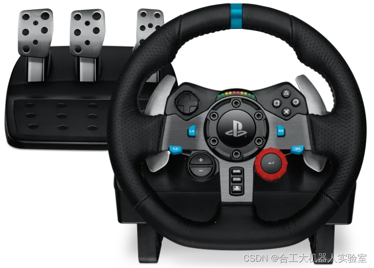

# ParallelDriving
> 平行驾驶软件文档

```bash
ubuntu 18.04
ros melodic

ros小车：yhs_FR 07
方向盘：罗技G29
```

### 1. 连接CAN

这里使用的是创芯的CAN驱动

1. can 盒 can1 的 H 与底盘 can 的 H 连接,can 盒 can1 的 L 与底盘 can 的 L 连接。起一个终端，输入：

   ```bash
   lsusb
   Bus 001 Device 001: ID 1d6b:0002 Linux Foundation 2.0 root hub
   Bus 002 Device 004: ID 04d8:0053 Microchip Technology, Inc.
   Bus 002 Device 003: ID 0e0f:0002 VMware, Inc. Virtual USB Hub
   Bus 002 Device 002: ID 0e0f:0003 VMware, Inc. Virtual Mouse
   Bus 002 Device 001: ID 1d6b:0001 Linux Foundation 1.1 root hub
   ```

   上面出现 `ID 04d8:0053 Microchip Technology, Inc.` 说明识别到CAN设备。

2. 查看系统内所有USB设备节点及其访问权限：

   ```bash
   ls /dev/bus/usb/ -lR
   ```

3. 修改`usb`设备的访问权限使普通用户可以操作，其中`xxx`对应`lsusb`输出信息中的bus序号，`yyy`对应`device`序号：

   ```bash
   chmod 666 /dev/bus/usb/xxx/yyy
   ```

4. 如果要永久赋予普通用户操作`USBCAN`设备的权限，需要修改`udev`配置，增加文件：`/etc/udev/rules.d/99-myusb.rules`，内容如下：

   ```bash
   sudo vi /etc/udev/rules.d/99-myusb.rules
   # 填如以下内容
   ACTION=="add",SUBSYSTEMS=="usb", ATTRS{idVendor}=="04d8", ATTRS{idProduct}=="0053", GROUP="users", MODE="0777"
   ```

5. 重新加载udev规则后插拔设备即可应用新权限：

   ```
   udevadm control --reload
   ```

6. 进入`catkin_PD`工作目录，运行

   ```bash
   roslaunch launch/run.launch
   ```

7. 查看终端是否有 `>>open deivce success!` 输出。然后另起一终端，输入:

   ```bash
   rostopic list
   /Drive_MCUEcoder_fb
   /Veh_Diag_fb
   /bms_Infor_fb
   /bms_flag_Infor_fb
   /clock
   /ctrl_cmd
   /ctrl_fb
   /diagnostics
   /hik_cam_node/hik_camera
   /io_cmd
   /io_fb
   /joy
   /lr_wheel_fb
   /odo_fb
   /rosout
   /rosout_agg
   /rr_wheel_fb
   ```

   若有上面话题，且 `rostopic echo -c /ctrl_fb` 有数据则调试成功。

### 2. 环境配置

#### 2.1 安装罗技方向盘驱动

1. 首先要确定插入的设备哪一个是G29方向盘，输入

   ```bash
   ls dev/input
   # 一般来说输出 js0
   ```

2. 查看方向盘信息，在终端输入:

   ```bash
   (base) redwall@redwall-desktop:~$ cat /dev/input/js0 | hexdump
   0000000 d754 0053 0000 0081 d754 0053 0000 0181
   0000010 d754 0053 0000 0281 d754 0053 0000 0381
   0000020 d754 0053 0000 0481 d754 0053 0000 0581
   0000030 d754 0053 0000 0681 d754 0053 0000 0781
   0000040 d754 0053 0000 0881 d754 0053 0000 0981
   # 有上述输出表示已经连接罗技方向盘
   ```

3. 安装操纵杆的校准工具：`jstest-gtk`

   ```bash
   sudo apt install jstest-gtk
   # 然后运行图形界面
   jstest-gtk /dev/input/js0
   ```

   

   在该界面可以测试罗技方向盘的各种按键

4. 安装罗技方向盘的ROS驱动

   ```bash
   sudo apt-get install ros-melodic-joy
   sudo aptitude install ros-melodic-joystick
   sudo apt-get install ros-melodic-joystick-drivers
   rosdep install joy
   rosmake joy
   ```

5. 启动ros后，新开一终端启动 joy 节点

   ```bash
   rosrun joy joy_node
   # 查看现有话题
   (base) redwall@redwall-desktop:~/catkin_ws$ rostopic list 
   /diagnostics
   /joy
   /joy/set_feedback
   /rosout
   /rosout_agg
   ```

   其中`/joy`话题包含了需要的方向盘信息，查看`/joy`话题的内容

   ```bash
   js@js-Mi:~$ rostopic echo -c /joy
   ---
   header: 
     seq: 386
     stamp: 
       secs: 1657894839
       nsecs: 565566079
     frame_id: "/dev/input/js0"
   axes: [0.648137629032135, 0.0, 0.0, 0.0, 0.0, 0.0]
   buttons: [0, 0, 0, 0, 0, 0, 0, 0, 0, 0, 0, 0, 0, 0, 0, 0, 0, 0, 0, 0, 0, 0, 0, 0, 0]
   ```

   查看`/joy`话题的信息

   ```bash
   js@js-Mi:~$ rostopic info /joy
   Type: sensor_msgs/Joy
   
   Publishers: 
    * /joy_node (http://redwall-desktop:41415/)
   
   Subscribers: None
   ```

   可以看到该话题是由`/joy_node`节点发布的，信息的数据类型为`sensor_msgs/Joy`

   查看`sensor_msgs/Joy`的消息格式:

   ```bash
   js@js-Mi:~$ rosmsg show sensor_msgs/Joy
   std_msgs/Header header
     uint32 seq		# 消息序列
     time stamp		# 消息的时间戳
     string frame_id	# 消息的来源
   float32[] axes		# 方向盘中轴的信息，以数组的形式
   int32[] buttons		# 方向盘中按键的信息，以数组的形式
   ```

#### 2.2 配置ROS分布式模式

运行平行驾驶的ROS节点称为 `master` (主机)节点，运行小车与摄像头驱动的工控机称为 `sliver` (从机)节点。确保 master节点和sliver节点IP处于同一网段

- 主机IP：192.168.50.23
- 从机IP：192.168.50.76

##### 2.2.1 Master 节点配置

1. 终端输入 `sudo gedit /etc/hosts ` 添加

   ```bash
   192.168.50.76	autolabor-hosts # Sliver(从机)ip和机器名
   ```

2. 终端输入 `sudo gedit .bashrc` 添加

   ```bash
   export ROS_MASTER_URI=http://192.168.50.23:11311   #192.168.50.23是主机ip
   export ROS_HOSTNAME=192.168.50.23	#192.168.50.23 是主机ip
   ```

   保存后关闭，输入 `source .bashrc` 使得环境变量生效

##### 2.2.2 Sliver 节点配置

1. 终端输入 `sudo gedit /etc/hosts ` 添加

   ```bash
   192.168.50.23	js-Mi # Master(主机)ip和机器名
   ```

2. 终端输入 `sudo gedit .bashrc` 添加

   ```bash
   export ROS_MASTER_URI=http://192.168.50.23:11311   #192.168.50.23是主机ip
   export ROS_HOSTNAME=192.168.50.76	#192.168.50.76 是从机ip
   ```

   保存后关闭，输入 `source .bashrc` 使得环境变量生效。

   其实第二步可以不在 .bashrc 文件中设置。只需要在运行ros命令的终端中输入 `export ROS_MASTER_URI=http://192.168.50.23:11311` 也可以，避免来回修改 .bashrc 文件。这样只对当前终端有效。

### 3. 软件使用

文件介绍：

```bash
3.parallel_driving
├── launch
	├── run.launch				# 启动小车驱动
	├── run_car1.launch			# 启动car1的小车和相机驱动，run_car2.launch同理
	├── runJoy.launch			# 启动罗技方向盘节点
└── src
    ├── hikvision_ros			# 海康相机ROS驱动
    ├── joy_to_car				# 方向盘控制小车的节点
    ├── yhs_can_control			# ROS小车驱动
    └── yhs_can_msgs			# ROS小车用到的消息
```

#### 3.1 启动软件

1. **修改相机IP**

   本软件用到海康威视网络摄像头，默认`IP` 为 `192.168.1.64` 。将摄像头通过网线与电脑连接，并修改电脑 `IP` 至 `192.168.1.XXX` 网段。然后打开浏览器输入 `192.168.1.64` 进入，设置摄像头的用户名与密码。

   选择配置->视音频 可以修改摄像头视频参数，程序使用的分辨率为 `1080x720p` ，选择到相应分辨率即可。

   

   选择配置->网络->基本配置，修改摄像头IP地址，将其修改为局域网同一网段。笔者当前网段为`192.168.50.XXX` ,修改如下：，点击保存即可

   

   建议将所有摄像头用户名密码设置为相同，避免后续挨个配置。

2. **运行平行驾驶软件**

   - 终端进入 `3.parallel_driving/parallel_driving` 文件夹，输入

     ```bash
     ./parallel_driving-x86_64.AppImage
     ```

     即可启动软件，点击右上角车辆配置，依次填入主节点地址、IP、名称，然后点击启动ROS即可。**注意：在启动小车驱动之前必须先启动软件并连接ROS。**

     

3. **运行小车驱动**

   - 将 `catkin_PD` 工作区复制到小车工控机，然后 `catkin_make` 编译

   - 打开 `catkin_PD/launch/run_car1.launch` 文件，做如下修改

     ```bash
     # 1.配置当前小车的名称，默认 car1
     <arg name="car1_name" default="car1"/> 
     # 2.配置相机IP地址，有几个相机就设置几个，然后把相应的节点注释取消
     <arg name="ip_addr_1" default="192.168.50.70"/>
     # 3.相机的用户名和密码，根据实际填写
     <arg name="user_name" default="admin"/>
     <arg name="password" default="js123456"/>
     ```

   - 若ROS分布式没有修改 `~/.bashrc` 配置文件，则工控机起一终端指定Master地址：

     ```bash
     export ROS_MASTER_URI=http://192.168.50.76:11311
     ```

     然后运行：

     ```bash
     roslaunch launch/run_car1.launch
     ```

     > 如果有多辆小车，可以把本工作空间复制，然后根据上述进行修改
     >
     > 如：对于第二辆小车，可以在 run_car2.launch 中进行配置车名以及相机地址，然后运行该 launch 文件即可

#### 3.2 软件使用

##### 3.2.1 软件界面

软件界面- 右

- 该界面可以展示两个摄像头画面
- 右边展示当前ROS连接状态


点击车辆配置进行相关配置

- 左侧依次填入Master节点地址、IP、节点名，然后点击启动ROS按钮启动
- 然后启动小车，接着点击刷新节点按钮，下拉框中会显示当前ROS环境中存在的小车节点，
- 选择节点后，右侧区域会显示该节点发布的相机话题，勾选需要订阅的话题前，然后点击确认按钮连接小车并显示小车摄像头画面


软件界面-中 ：

- 显示小车前方画面

  

软件界面-左

- 该界面右边可以展示两个摄像头画面
- 左边可以实时展示车辆运行状态，包括速度、档位、方形盘角度。


##### 3.2.2 软件控制小车操作

当界面焦点在界面-右上时，可以使用键盘控制小车：

- 开始时需要先按下 键盘 `P` 键接触驻车档
- 方向键上下为前进和后退，长按加速。
- 方向键左右为转向，长按转向角增加
- 空格为刹车

##### 3.2.3 罗技方向盘控制小车操作

罗技方形盘启动方法，电脑连接好方向盘、按照上述装好驱动后

另起终端进入 `3.parallel_driving/catkin_PD` 文件夹，运行

```bash
roslaunch launch/runJoy.launch
```

即可启动。**当软件检测到方向盘接入时，会自动切换至方向盘控制。**如下所示：


当方向盘程序关闭时，会自动切换至软件控制小车


**方向盘控制方法：**

- 默认空挡，档位推向前为前进挡；档位往后推为后退档

- 脚踏板中间为刹车、右边为油门

- 方向盘控制车辆转向

- 右下方红色按键为喇叭

  

##### 3.2.4 切换小车

当启动多个小车时，可以在车辆配置页面点击 `刷新节点` 按钮查看当前网络中的小车节点。在下拉列表中选择对应的车辆，然后选择相应的图像话题，点击 `确认` 按钮即可实现车辆切换。此时不管是在软件控制小车、还是方向盘在控制小车，都会自动切换至选择的小车。

##### 3.2.5 修复畸变

将鼠标移动到画面上，右键菜单选择`加载相机配置` 菜单，弹出页面选择 `3.parallel_driving/parallel_driving/config` 中的相机内参文件，选择确认后会看到畸变已经修复。


修复前：

可以看到存在明显的畸变


修复后：


