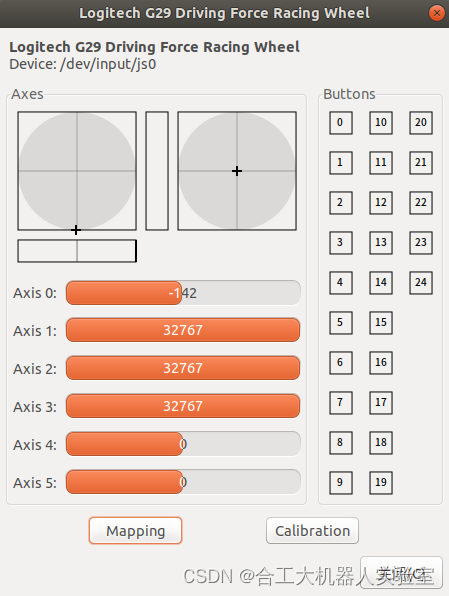

# ParallelDriving
> 平行驾驶软件文档

```bash
ubuntu 18.04
ros melodic

ros小车：yhs_FR 07
方向盘：罗技G29
```

### 1. 连接CAN

这里使用的是创芯的CAN驱动

1. can 盒 can1 的 H 与底盘 can 的 H 连接,can 盒 can1 的 L 与底盘 can 的 L 连接。起一个终端，输入：

   ```bash
   lsusb
   Bus 001 Device 001: ID 1d6b:0002 Linux Foundation 2.0 root hub
   Bus 002 Device 004: ID 04d8:0053 Microchip Technology, Inc.
   Bus 002 Device 003: ID 0e0f:0002 VMware, Inc. Virtual USB Hub
   Bus 002 Device 002: ID 0e0f:0003 VMware, Inc. Virtual Mouse
   Bus 002 Device 001: ID 1d6b:0001 Linux Foundation 1.1 root hub
   ```

   上面出现 `ID 04d8:0053 Microchip Technology, Inc.` 说明识别到CAN设备。

2. 查看系统内所有USB设备节点及其访问权限：

   ```bash
   ls /dev/bus/usb/ -lR
   ```

3. 修改`usb`设备的访问权限使普通用户可以操作，其中`xxx`对应`lsusb`输出信息中的bus序号，`yyy`对应`device`序号：

   ```bash
   chmod 666 /dev/bus/usb/xxx/yyy
   ```

4. 如果要永久赋予普通用户操作`USBCAN`设备的权限，需要修改`udev`配置，增加文件：`/etc/udev/rules.d/99-myusb.rules`，内容如下：

   ```bash
   sudo vi /etc/udev/rules.d/99-myusb.rules
   # 填如以下内容
   ACTION=="add",SUBSYSTEMS=="usb", ATTRS{idVendor}=="04d8", ATTRS{idProduct}=="0053", GROUP="users", MODE="0777"
   ```

5. 重新加载udev规则后插拔设备即可应用新权限：

   ```
   udevadm control --reload
   ```

6. 进入`catkin_master`工作目录，运行

   ```bash
   roslaunch launch/run.launch
   ```

7. 查看书否有 `>>open deivce success!` 输出。然后另起一终端，输入:

   ```bash
   rostopic list
   /Drive_MCUEcoder_fb
   /Veh_Diag_fb
   /bms_Infor_fb
   /bms_flag_Infor_fb
   /clock
   /ctrl_cmd
   /ctrl_fb
   /diagnostics
   /hik_cam_node/hik_camera
   /io_cmd
   /io_fb
   /joy
   /lr_wheel_fb
   /odo_fb
   /rosout
   /rosout_agg
   /rr_wheel_fb
   ```

   若有上面话题，且 `rostopic echo -c /ctrl_fb` 有数据则调试成功。

### 2. 环境配置

#### 2.1 安装罗技方向盘驱动

1. 首先要确定插入的设备哪一个是G29方向盘，输入

   ```bash
   ls dev/input
   # 一般来说输出 js0
   ```

2. 查看方向盘信息，在终端输入:

   ```bash
   (base) redwall@redwall-desktop:~$ cat /dev/input/js0 | hexdump
   0000000 d754 0053 0000 0081 d754 0053 0000 0181
   0000010 d754 0053 0000 0281 d754 0053 0000 0381
   0000020 d754 0053 0000 0481 d754 0053 0000 0581
   0000030 d754 0053 0000 0681 d754 0053 0000 0781
   0000040 d754 0053 0000 0881 d754 0053 0000 0981
   # 有上述输出表示已经连接罗技方向盘
   ```

3. 安装操纵杆的校准工具：`jstest-gtk`

   ```bash
   sudo apt install jstest-gtk
   # 然后运行图形界面
   jstest-gtk /dev/input/js0
   ```

   

   在该界面可以测试罗技方向盘的各种按键

4. 安装罗技方向盘的ROS驱动

   ```bash
   sudo apt-get install ros-melodic-joy
   sudo aptitude install ros-melodic-joystick
   sudo apt-get install ros-melodic-joystick-drivers
   rosdep install joy
   rosmake joy
   ```

5. 启动ros后，新开一终端启动 joy 节点

   ```bash
   rosrun joy joy_node
   # 查看现有话题
   (base) redwall@redwall-desktop:~/catkin_ws$ rostopic list 
   /diagnostics
   /joy
   /joy/set_feedback
   /rosout
   /rosout_agg
   ```

   其中`/joy`话题包含了需要的方向盘信息，查看`/joy`话题的内容

   ```bash
   js@js-Mi:~$ rostopic echo -c /joy
   ---
   header: 
     seq: 386
     stamp: 
       secs: 1657894839
       nsecs: 565566079
     frame_id: "/dev/input/js0"
   axes: [0.648137629032135, 0.0, 0.0, 0.0, 0.0, 0.0]
   buttons: [0, 0, 0, 0, 0, 0, 0, 0, 0, 0, 0, 0, 0, 0, 0, 0, 0, 0, 0, 0, 0, 0, 0, 0, 0]
   ```

   查看`/joy`话题的信息

   ```bash
   js@js-Mi:~$ rostopic info /joy
   Type: sensor_msgs/Joy
   
   Publishers: 
    * /joy_node (http://redwall-desktop:41415/)
   
   Subscribers: None
   ```

   可以看到该话题是由`/joy_node`节点发布的，信息的数据类型为`sensor_msgs/Joy`

   查看`sensor_msgs/Joy`的消息格式:

   ```bash
   js@js-Mi:~$ rosmsg show sensor_msgs/Joy
   std_msgs/Header header
     uint32 seq		# 消息序列
     time stamp		# 消息的时间戳
     string frame_id	# 消息的来源
   float32[] axes		# 方向盘中轴的信息，以数组的形式
   int32[] buttons		# 方向盘中按键的信息，以数组的形式
   ```

#### 2.2 配置ROS分布式模式

运行在小车上位机的ROS节点称为 `master` (主机)节点，运行平行驾驶软件的机器称为 `sliver` (从机)节点。确保 master节点和sliver节点IP处于同一网段

- 主机IP：192.168.50.76
- 从机IP：192.168.50.23

##### 2.2.1 Master 节点配置

1. 终端输入 `sudo gedit /etc/hosts ` 添加

   ```bash
   192.168.50.23	js-Mi # Sliver(从机)ip和机器名
   ```

2. 终端输入 `sudo gedit .bashrc` 添加

   ```bash
   export ROS_MASTER_URI=http://192.168.50.76:11311   #192.168.50.76是主机ip
   export ROS_HOSTNAME=192.168.50.76	#192.168.50.76 是主机ip
   ```

   保存后关闭，输入 `source .bashrc` 使得环境变量生效

##### 2.2.2 Sliver 节点配置

1. 终端输入 `sudo gedit /etc/hosts ` 添加

   ```bash
   192.168.50.76	autolabor-hosts # Master(主机)ip和机器名
   ```

2. 终端输入 `sudo gedit .bashrc` 添加

   ```bash
   export ROS_MASTER_URI=http://192.168.50.76:11311   #192.168.50.76是主机ip
   export ROS_HOSTNAME=192.168.50.23	#192.168.50.23 是从机ip
   ```

   保存后关闭，输入 `source .bashrc` 使得环境变量生效。

   其实第二步可以不在 .bashrc 文件中设置。只需要在运行ros命令的终端中输入 `export ROS_MASTER_URI=http://192.168.50.76:11311` 也可以，避免来回修改 .bashrc 文件。

### 3. 软件使用

#### 3.1 启动软件

1. 主机Master进入`catkin_master`文件，`catkin_make` 编译后运行：

   ```bash
   roslaunch launch/run.launch
   ```

2. 进入`parallel_driving/catkin_cx_07` 文件夹打开终端，首先指定Master节点：

   ```bash
   export ROS_MASTER_URI=http://192.168.50.76:11311
   ```

   然后`catkin_make`编译后运行 joy 节点控制小车运动：

   ```bash
   roslaunch launch/runJoy.launch
   ```

3. 启动 平行驾驶软件：

   ```bash
   # 进入 parallel_driving 文件夹，终端运行
   ./AppRun
   ```

   即可打开软件

#### 3.2 软件使用

##### 3.2.1 罗技方向盘控制小车操作

- 默认空挡，档位退向前，选择前进挡，档位往后退，选择后退档

- 脚踏板中间为刹车、右边为油门

- 方向盘控制车辆转向

- 下方红色按键为喇叭

  

##### 3.2.2 软件操作方法

软件界面- 右


点击车辆配置进行ROS话题配置


点击确认，即可显示 `界面-左` 和`界面-中` ：

 


当界面焦点在界面-右上时，可以使用键盘控制小车：

- 开始时需要先按下 键盘 `P` 键接触驻车档
- 方向键上下为前进和后退，长按加速。
- 方向键左右为转向，长按转向角增加
- 空格为刹车

对于左边界面，仪表盘可以实时显示车辆速度，以及档位，方向盘转向可以实时显示车辆当前的转向状态。


